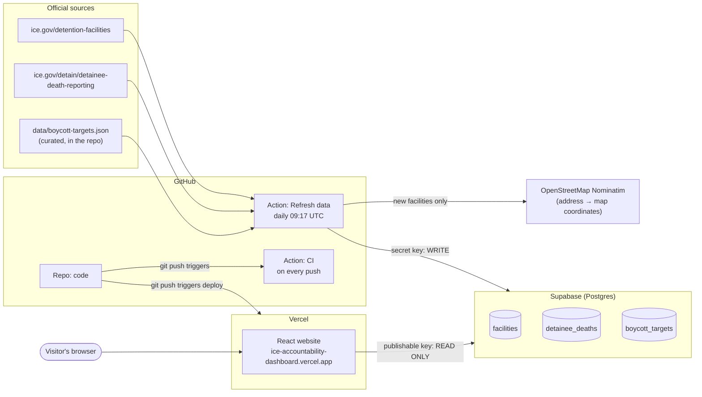

# ICE Accountability Dashboard — How it works

> [!summary]
> A public dashboard showing ICE detention facilities (map), deaths in custody since FY2021 (charts + table), and corporate boycott targets (table).
> **Three services, one job each:**
> - **GitHub** stores the code and runs the scraper every morning.
> - **Supabase** is the database.
> - **Vercel** hosts the public website.

## Architecture diagram



## How data flows

1. **Every morning at 09:17 UTC**, GitHub starts the *Refresh data* workflow on its own servers.
2. The scraper (`scraper/index.ts`) downloads the two ice.gov pages and reads the boycott JSON file.
3. It parses the HTML with **Cheerio**: 158 facilities (8 pages) and deaths from FY2021 onward.
4. It **upserts** into Supabase: new rows are inserted, existing rows are matched on a *natural key* and get their `last_seen_at` bumped. Nothing is duplicated.
   - facilities → `name + address`
   - deaths → `name + date_of_death`
   - boycott targets → `company_name`
5. Facilities without coordinates are geocoded with **OpenStreetMap Nominatim** (1 request/second). After the first run this is ~0 calls a day.
6. When someone opens the website, their browser asks Supabase for the rows directly and draws the map, charts and tables.

> [!info] The website never needs redeploying for new data
> The site fetches from the database on every page load, so each morning's refresh shows up automatically. A redeploy is only needed when the **code** changes.

## Tech stack

| Layer | Tool | Why |
| --- | --- | --- |
| Frontend | React + TypeScript + Vite | Standard, fast build |
| Data fetching | TanStack Query | Caching, loading/error states |
| Tables | TanStack Table v9 | Sorting + search |
| Map | react-leaflet + OpenStreetMap tiles | Free, no API key |
| Charts | Recharts | Deaths per year / by facility |
| Database | Supabase (Postgres) | Free tier, instant REST API |
| Scraper | Node + Cheerio | Parses ice.gov HTML |
| Scheduler | GitHub Actions (cron) | Free, logs = change history |
| Hosting | Vercel | Auto-deploys from GitHub |

## Repo layout

```
ice-accountability-dashboard/
├── scraper/                  # runs in GitHub Actions
│   ├── index.ts              # entry: parse → upsert → geocode
│   ├── facilities.ts         # ice.gov facilities parser (paginated)
│   ├── deaths.ts             # ice.gov deaths parser (FY2021+)
│   ├── boycott.ts            # loads data/boycott-targets.json
│   ├── geocode.ts            # OpenStreetMap Nominatim
│   └── db.ts                 # Supabase upsert helper
├── src/                      # the website (Vercel)
│   ├── App.tsx               # layout + headline stats
│   ├── components/           # FacilityMap, DeathsSection, BoycottSection, DataTable
│   ├── hooks/queries.ts      # TanStack Query → Supabase
│   └── lib/supabase.ts       # client (publishable key)
├── supabase/migrations/0001_init.sql   # tables + security rules
├── data/boycott-targets.json           # curated list
└── .github/workflows/
    ├── refresh-data.yml      # daily scraper
    └── ci.yml                # typecheck + build on push
```

## Setup: what we did, in order

### 1. Code (local)
- [x] Inspected the real ice.gov HTML to write accurate parsers
- [x] Built the scraper and tested it with `npm run scrape:dry` (no database needed)
- [x] Built the React app and checked it in light mode, dark mode and at phone width
- [x] Created a **private** GitHub repo and pushed the code

> [!note] GitHub permission hiccup
> The first push was rejected because the `gh` login lacked the **`workflow`** scope, which is required to upload files in `.github/workflows/`. Fixed with `gh auth refresh -h github.com -s workflow` and approving the one-time code at github.com/login/device.

### 2. Supabase — the database
- [x] Created a project (region: West US / Oregon)
- [x] **SQL Editor → New query →** pasted `supabase/migrations/0001_init.sql` **→ Run**
  - Created the 3 tables with unique natural keys
  - Turned on **Row Level Security** with a "public read" policy: anyone can *read*, nobody can *write* with the public key
- [x] Got the keys from **Project Settings → API Keys**

> [!warning] Two keys, two very different jobs
> | Key | Starts with | Can do | Lives in |
> | --- | --- | --- | --- |
> | Publishable | `sb_publishable_` | read only (RLS) | Vercel — safe to be public |
> | Secret | `sb_secret_` | everything, bypasses RLS | GitHub secrets **only** — never commit or share |

### 3. GitHub — code + automation
- [x] **Settings → Secrets and variables → Actions** — added:
  - `SUPABASE_URL`
  - `SUPABASE_SERVICE_ROLE_KEY` (the **secret** key)
- [x] **Actions → Refresh data → Run workflow** to load the data the first time
  - Result: 158 facilities, 84 deaths, 155/158 facilities placed on the map
- [x] Updated the workflows from Node 20 to Node 24 versions of `checkout`/`setup-node` to clear a deprecation warning

Two workflows:
- **Refresh data** (`refresh-data.yml`) — daily cron + manual button. Runs the scraper.
- **CI** (`ci.yml`) — on every push. Checks the code typechecks and builds.

### 4. Vercel — the website
- [x] **Add New → Project →** imported `ice-accountability-dashboard` (gave the Vercel GitHub app access to the private repo)
- [x] Preset: **Vite** (auto-detected), root `./`
- [x] Environment variables:
  - `VITE_SUPABASE_URL`
  - `VITE_SUPABASE_ANON_KEY` (the **publishable** key)
- [x] **Deploy** → https://ice-accountability-dashboard.vercel.app
- [x] Fixed a production-only bug where map markers lost their styling (`className` must be a direct prop on react-leaflet's `CircleMarker`, not inside `pathOptions`)

> [!tip] `VITE_` prefix
> Vite only exposes environment variables that start with `VITE_` to the browser. That's also why the secret key must **never** get a `VITE_` name.

## Is the data refreshing automatically?

**Yes.**

| What | When | Trigger |
| --- | --- | --- |
| Database refresh | Daily, 09:17 UTC | GitHub Actions cron |
| Website shows new data | Next page load | Browser queries Supabase directly |
| Website code redeploy | Every `git push` to `main` | Vercel ↔ GitHub integration |
| Build check | Every push | GitHub Actions CI |

Where to check a refresh happened:
- **GitHub → Actions → Refresh data** — each run's log shows `[upsert] facilities: N`, `[upsert] detainee_deaths: N`
- **Supabase → Table Editor** — look at the rows / `last_seen_at`
- **The site** — "Data last refreshed …" under the headline numbers

> [!caution] Things that could stop it
> - **GitHub disables scheduled workflows after 60 days with no repo activity** (applies once the repo is public). Re-enable from the Actions tab, or push any commit.
> - **Supabase pauses free projects** after a period of inactivity. The daily writes should keep it awake; if it does pause, click **Restore** in the dashboard.
> - **ice.gov changes its page layout.** The scraper refuses to save if it parses 0 rows, so the run turns red and nothing is overwritten. Check the Actions log.
> - **Private repo Actions minutes:** the free plan includes 2,000 min/month; a daily run takes ~1–6 min.

## Everyday tasks

- **Run the scraper now:** GitHub → Actions → Refresh data → Run workflow
- **Preview locally:** `npm run dev` (needs `.env.local`) → http://localhost:5173
- **Test the parsers without touching the DB:** `npm run scrape:dry`
- **Add a boycott target:** edit `data/boycott-targets.json` (`company_name` + `source_url` required), push, then run the workflow
- **Ship a code change:** `git push` → Vercel redeploys in ~1 min
- **Make the repo public:** `gh repo edit --visibility public --accept-visibility-change-consequences`

## Scope (firm)

This project does **not** include, scrape or reference:
- Data about individual ICE or CBP agents (identities, alleged records, photos)
- "Incident" data tied to named individuals
- theicelist.org or any of its subpages

## Open to-dos

- [ ] Push the map marker fix (`git push`)
- [ ] Choose boycott campaign sources and fill `data/boycott-targets.json`
- [ ] Hand-place the 3 facilities that couldn't be geocoded
- [ ] (Optional) Extract the facility for each death from ICE's PDF reports
- [ ] (Optional) Make the repo public / add a custom domain / link from portfolio
